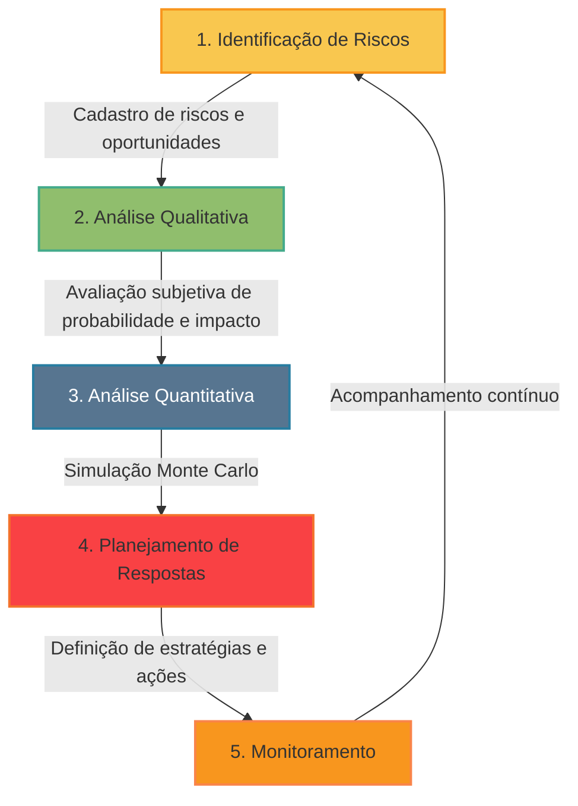

# Bem-vindo ao Sistema Avançado de Análise e Gestão de Riscos em Reformas!

## Visão Geral
Reformar pode ser uma jornada emocionante, mas também repleta de imprevistos que podem transformar o sonho em um desafio. Este aplicativo foi cuidadosamente desenhado para ser seu parceiro estratégico, capacitando-o(a) a navegar pelas incertezas com maior confiança. Ao invés de apenas reagir aos problemas, você aprenderá a antecipá-los, compreendendo os potenciais riscos e, crucialmente, as oportunidades que podem surgir. Uma gestão de riscos eficaz não só previne estouros de orçamento e atrasos frustrantes, mas também pode otimizar recursos, melhorar a qualidade final e, em última análise, garantir que sua reforma alcance os objetivos desejados com menos stress e mais controle.

Este sistema guia você através das etapas essenciais do gerenciamento de riscos, desde a configuração inicial e identificação detalhada, passando por análises qualitativas e quantitativas robustas, até o planejamento de respostas e o monitoramento contínuo do seu projeto.

## Fluxo Visual do Processo de Gestão de Riscos

## Como Usar o Aplicativo (Navegação pelas Páginas)

1.  **`0_Configuracao_Usuario_e_Projeto.py`**:
    * **O que fazer:** Inicie registrando seus dados de contato e os detalhes fundamentais da sua obra (nome, classificação, propósito principal, e o valor total estimado). Em seguida, defina o perfil de risco do seu projeto, indicando seu apetite geral a riscos e as tolerâncias específicas para desvios de custo e prazo.
    * **Valor para você:** Estas informações personalizam toda a sua experiência na ferramenta, ajustam a sensibilidade de algumas análises e são cruciais para a contextualização dos relatórios gerados, tornando-os diretamente aplicáveis à sua realidade.

2.  **`1_Identificacao_e_Cadastro_de_Riscos.py`**:
    * **O que fazer:** Esta é a base de toda a análise. Liste todos os possíveis eventos incertos – tanto ameaças (riscos negativos) quanto oportunidades (riscos positivos) – que podem impactar sua reforma. Utilize o CSV modelo para um início rápido ou cadastre cada item detalhadamente, incluindo descrições claras, categorias, os potenciais efeitos em custo e prazo, os gatilhos que podem sinalizar sua ocorrência, e as possíveis causas raiz.
    * **Valor para você:** Uma identificação abrangente é o primeiro passo para evitar surpresas. Quanto mais completa for sua lista, mais preparado você estará. As técnicas sugeridas (Brainstorming, Checklists, etc.) ajudam a expandir sua visão. **Lembre-se de clicar no botão "Atualizar Lista de Riscos" para salvar suas edições na tabela.**

3.  **`2_Analise_Qualitativa_de_Riscos.py`**:
    * **O que fazer:** Para cada risco e oportunidade identificado, avalie subjetivamente a probabilidade de sua ocorrência e a magnitude dos seus impactos (em custo, prazo, qualidade, etc.). Atribua também um nível de urgência para indicar quando o risco pode demandar atenção. O sistema calculará um "score" de risco, ajudando a priorizar.
    * **Valor para você:** Permite focar sua atenção e recursos nos riscos mais significativos de forma rápida, sem a necessidade de dados numéricos complexos. A Matriz de Probabilidade x Impacto oferece uma visualização clara dessa priorização. **Salve suas análises para prosseguir.**

4.  **`3_Analise_Quantitativa_e_Probabilistica.py`**:
    * **O que fazer:** Para os riscos mais críticos (identificados na etapa anterior), refine as estimativas de impacto com faixas numéricas (mínimo e máximo). O sistema calculará o Valor Monetário Esperado (VME) de cada risco. A funcionalidade principal aqui é a Simulação de Monte Carlo, que executa milhares de cenários do seu projeto, considerando as incertezas, para gerar distribuições de probabilidade para o custo e prazo totais.
    * **Valor para você:** Entenda a exposição total do seu projeto aos riscos de forma numérica. Os resultados da simulação (histogramas, curvas S) ajudam a definir reservas de contingência mais realistas (quanto dinheiro e tempo "extra" você pode precisar) e a análise de sensibilidade mostra quais riscos têm maior poder de influenciar o resultado final do projeto.

5.  **`4_Planejamento_de_Respostas_aos_Riscos.py`**:
    * **O que fazer:** Com base nas análises, defina como você vai lidar com cada risco prioritário. Para ameaças, pode ser eliminar, mitigar (reduzir), transferir (para um terceiro) ou aceitar. Para oportunidades, pode ser explorar (garantir que aconteça), melhorar (aumentar o benefício), compartilhar ou aceitar. Detalhe as ações específicas, designe um proprietário (responsável), defina prazos e estime custos para cada resposta. Considere também planos de contingência (o que fazer se o risco ocorrer mesmo assim) e possíveis riscos secundários (novos riscos gerados pelas suas ações de resposta).
    * **Valor para você:** Transforma a análise de risco em ação proativa. Um plano de respostas bem definido aumenta significativamente suas chances de sucesso e controle sobre o projeto. **Salve seu plano para referência e monitoramento.**

6.  **`5_Monitoramento_e_Relatorios_de_Riscos.py`**:
    * **O que fazer:** A gestão de riscos não termina no planejamento. Ao longo da execução da reforma, acompanhe o status dos riscos e a implementação das ações de resposta. Atualize o progresso, observe se os gatilhos de risco estão aparecendo e ajuste seus planos conforme necessário. Gere relatórios em HTML com o status atualizado para comunicação com stakeholders e para manter um registro histórico.
    * **Valor para você:** Mantém a análise de risco viva e relevante, permitindo adaptações e garantindo que as estratégias definidas estão sendo eficazes. O relatório ajuda na comunicação e na tomada de decisões informadas durante todo o projeto.

## Conceitos Fundamentais de Gestão de Riscos

### O que é um risco?
Um risco é um evento ou condição incerta que, se ocorrer, pode ter um efeito positivo (oportunidade) ou negativo (ameaça) sobre pelo menos um objetivo do projeto, como custo, prazo, qualidade ou escopo.

### Tipos de riscos em reformas:
- **Riscos Técnicos:** Relacionados a tecnologia, materiais, métodos construtivos
- **Riscos Externos:** Clima, fornecedores, regulações
- **Riscos Organizacionais:** Recursos humanos, financiamento, priorização
- **Riscos de Gerenciamento:** Planejamento, controle, comunicação

### Ciclo de vida da gestão de riscos:
1. **Identificação:** Reconhecer e documentar todos os possíveis riscos
2. **Análise Qualitativa:** Avaliar subjetivamente probabilidade e impacto
3. **Análise Quantitativa:** Quantificar numericamente o efeito dos riscos
4. **Planejamento de Respostas:** Definir ações para lidar com cada risco
5. **Monitoramento e Controle:** Acompanhar e ajustar durante todo o projeto

## Requisitos para Execução

### Pacotes Python Necessários:
- streamlit
- pandas
- numpy
- plotly
- gspread
- oauth2client

### Arquivos de Dados:
O sistema utiliza arquivos CSV para armazenar informações sobre riscos comuns e tipos de construções. Estes arquivos serão criados automaticamente ou podem ser carregados por você.

### Google Sheets para Logging (Opcional):
Para utilizar a funcionalidade de logging em Google Sheets, é necessário criar um arquivo de credenciais conforme instruções no README_DEV.md.

## Suporte e Contato

Se você encontrar problemas ou tiver sugestões para melhorar este aplicativo, entre em contato com:

Email: suporte@analiseriscoreforma.com.br
Site: www.analiseriscoreforma.com.br 